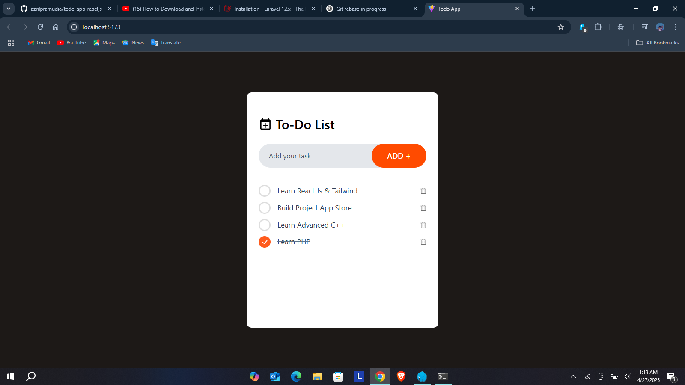

# 📝 Simple Todo App

A simple and minimalistic Todo application built with modern web technologies. Manage your tasks easily and stay productive!

---

## 🎥 Watch the Demo
Check out the video here 👉 [Watch Video](https://youtube.com)

---

## 🚀 Tech Stack
- **React** – Frontend library
- **JavaScript** – Programming language
- **Vite** – Build tool for fast development
- **Tailwind CSS** – Utility-first CSS framework

---

## ✨ Features
- Add new tasks
- Edit existing tasks
- Mark tasks as completed
- Delete tasks
- Responsive design for mobile and desktop

---

## 🖥️ Preview


---

## ⚙️ Installation

Follow these steps to run the project locally:

```bash
# Clone the repository
git clone https://github.com/your-username/simple-todo-app.git

# Navigate into the project directory
cd simple-todo-app

# Install dependencies
npm install

# Run the development server
npm run dev
